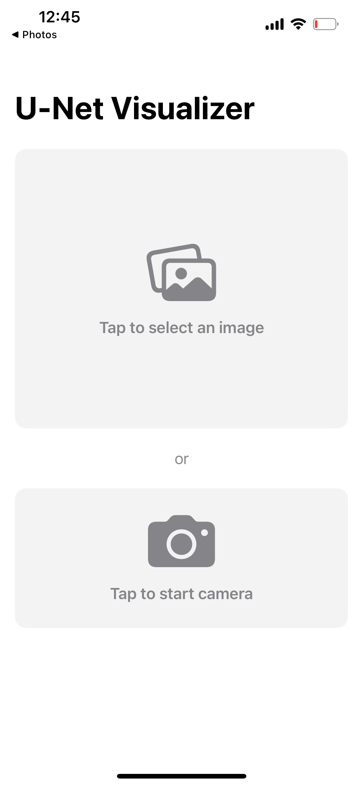
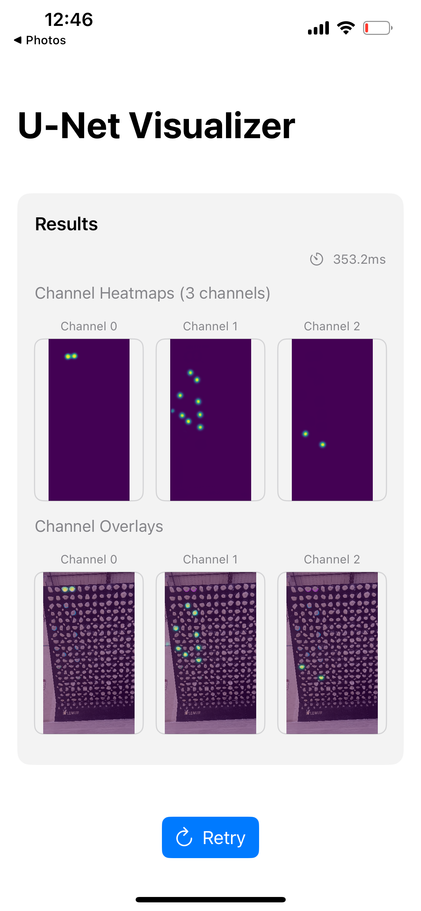

# UNetVisualizerKit 

A production-ready iOS framework for visualizing U-Net neural network predictions with real-time performance monitoring.


## 🎯 Mission

Computer vision developers often need to test their neural nets on devices: how they perform, what they predict. This repo helps developers visualize and debug neural network predictions on iOS devices by providing:
- 📱 **Real-time visualization** of U-Net style CNNs predictions with channel-specific views
- 🎨 **Model output** – renders per-channel masks, alpha-blends them over live camera or still images
- ⚡ **Performance metrics** – live FPS, per-inference latency, and energy-impact read-outs tell you exactly how your network behaves in production.


## 🚀 Quick Start

Getting started - just 3 steps:

### 1. Add the Package
In Xcode: **File → Add Package Dependencies** → `https://github.com/andrejnesterov/UNetVisualizerKit`

### 2. Copy the Demo ContentView
Copy `Examples/DemoApp/ContentView.swift` into your project:

```swift
import SwiftUI
import UNetVisualizerKit

struct ContentView: View {
    var body: some View {
        DemoVisualizationView(modelHandler: createModelHandler())
    }
    
    private func createModelHandler() -> UNetModelHandler {
        do {
            let modelHandler = try UNetModelHandler(modelName: "YourModelName")
            return modelHandler
        } catch {
            fatalError("Failed to load model: \(error)")
        }
    }
}
```

### 3. Replace Model Name & Run
Change `"YourModelName"` to your Core ML model name → Build & Run!

You'll get a complete visualization app with photo picker, camera, real-time processing, and performance metrics.

## 📱 Examples

<p align="center">
  
  
</p>

## 🏗 Architecture

UNetVisualizerKit follows a modular architecture designed for performance, maintainability, and ease of use. The framework is organized into five main layers:

### 📦 Core Components

```
Sources/UNetVisualizerKit/
├── Core/                    # 🧠 Neural Network & Processing Engine
│   ├── UNetModel.swift     # Core ML model wrapper with prediction pipeline
│   ├── UNetVisualizer.swift # Main visualizer class with processing logic
│   └── CameraView.swift    # Real-time camera capture integration
├── Visualization/           # 🎨 Rendering & Display Engine
│   ├── VisualizerView.swift # Main visualization view component
│   ├── ColorMap.swift      # Color mapping utilities (Viridis, Grayscale, etc.)
│   ├── DemoVisualizationView.swift # Complete demo UI with photo picker
│   ├── FullScreenImageView.swift   # Full-screen image viewing component
│   └── HelperViews.swift   # UI helper components (PlaceholderView, etc.)
├── Performance/             # ⚡ Monitoring & Optimization
│   ├── PerformanceMonitor.swift # FPS tracking, latency measurement
│   └── ImageCache.swift    # Memory-efficient image caching system
├── Models/                  # 📋 Data Structures & Protocols
└── Extensions/              # 🔧 Helper Extensions
```

### 🔄 Data Flow Architecture

```
Input Source → Model Handler → Visualizer → UI Components
     ↓              ↓             ↓           ↓
📷 Camera      🧠 UNetModel   🎨 Renderer   📱 SwiftUI
📷 Photos      ⚡ Inference   🎯 ColorMap   🖼️ Views
🖼️ Images      📊 Channels    🔄 Cache      📈 Metrics
```

## 🔧 Requirements

- iOS 15.0+
- Xcode 15.0+
- Swift 5.9+
- Core ML compatible device

## 🤝 Contributing

Contributions are welcomed! Please see the [Contributing Guidelines](CONTRIBUTING.md) for details.

## 📄 License

This project is licensed under the MIT License - see the [LICENSE](LICENSE) file for details.

## 🙏 Acknowledgments

- Apple Core ML team for the excellent framework
- The iOS ML community for inspiration and feedback

---

**Built with ❤️ for the iOS ML community**